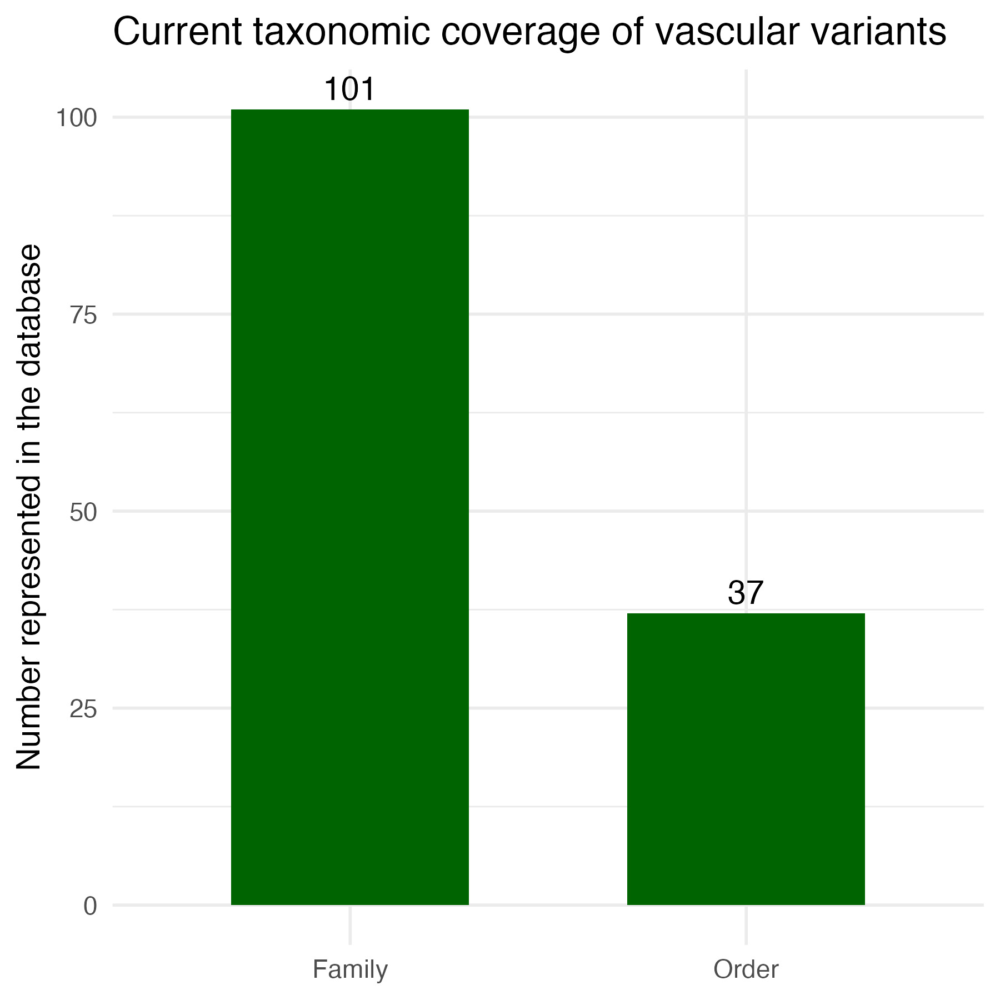

# Plant Vascular Variants Database
A curated, living database documenting the diversity of vascular variants across seed plants. The database operationalizes the vascular variants framework introduced in Cunha-Neto et al. (2023) and is continuously updated as new data and studies become available.

The Plant Vascular Variants Database is organized around a foundational **global survey**, which synthesizes historical terminology, classification, and phylogenetic distribution across seed plants, alongside **taxon-level datasets** that focus on individual orders or families and complement the global synthesis.

→ [View the Global Survey of Vascular Variants](data/global-survey)

## Background
Most seed plants exhibit a conserved pattern of vascular organization (“typical growth”). In contrast, many lineages exhibit alternative vascular tissue arrangements, collectively termed vascular variants. The vascular variants framework provides a standardized terminology and classification to describe these alternative developmental architectures and to facilitate evolutionary and functional studies across plants.	

## Database Structure
The Plant Vascular Variants Database is organized into two complementary components:

### 1. Core Framework & Global Survey (located in /data/global-survey)
This component represents an updated global survey that underlies the original framework and novel elements (e.g., functional categories). This dataset includes:
- Definitions of vascular variant categories and patterns.  
- Phylogenetic distribution of vascular variants across seed plant families.  
- Historical terminology used to describe vascular variants.  
- A glossary of terms associated with vascular variants.   

### 2. Modular Taxa-Specific Datasets (located in /data/taxa-datasets)
This component comprises high-resolution datasets focused on specific orders or families. The datasets include species-level coding and expanded anatomical or functional information. Each module includes a README that provides detailed scope and citation instructions.

### Taxonomic coverage figure
The figure below indicates the number of orders and families from seed plants in which vascular variants have been documented, based on the global survey of the Plant Vascular Variants Database. The figure is automatically generated from Table 2 ['data/global-survey/Table_2.csv'] using the script `scripts/summarize_orders_families.R`.

										
## Governance of the Plant Vascular Variants Database
The Plant Vascular Variants Database is a curated, living scientific resource maintained by Israel L. Cunha-Neto and collaborators.

### 1. Update Policy
Core framework updates occur when new evidence refines terminology, classification, or distribution. Modular datasets are updated in coordination with associated publications.  

### 2. Data Integrity
Changes to definitions or classifications will be documented in the release notes. Deprecated terms will remain archived for historical transparency. Each dataset retains its own citation boundary.

### 3. Contributions
Future contributions from collaborators may be incorporated as modular datasets following data curation. 

### 4. Project Status
This database is an actively maintained, living resource. Versioned releases are archived via Zenodo, while ongoing updates are curated through the GitHub repository. Curated anatomical and macroscopic images linked to selected taxa and vascular variant patterns will be added in future releases.

*Acknowledgements* and credits for feedback and assistance are provided in the ACKNOWLEDGEMENTS.md file.

## How to cite
The Plant Vascular Variants Database consists of a global framework-level survey and modular family-level datasets. These components should be cited separately when used independently.
- When using the concept, terminology, or definition of vascular variants, please cite:
	- Cunha-Neto I.L. 2023. Vascular variants in seed plants – a developmental approach. AoB Plants, 15(4): 1-15.
- When using the database or any of its contents, please cite:
	- Cunha-Neto, I.L. 2026. Plant Vascular Variants Database (V. 1.0.0) [Data set]. Zenodo. https://doi.org/10.5281/zenodo.18704993
- Users employing both the conceptual framework and the database are encouraged to cite both references.
- Use the specific order/family dataset citation provided in the README for the modules you use.

## Contact
For questions or corrections, please contact: Israel L. Cunha-Neto | Florida International University | ilcneto@fiu.edu

## License
This project is licensed under the terms of the Creative Commons Attribution 4.0 license.
